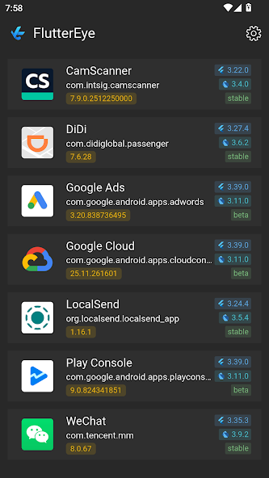
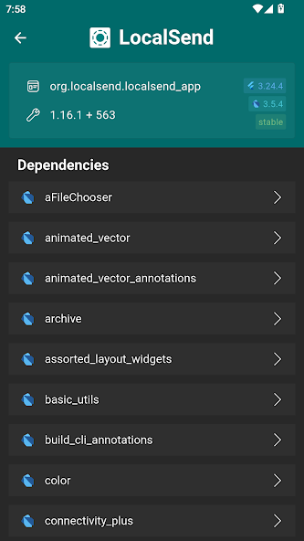
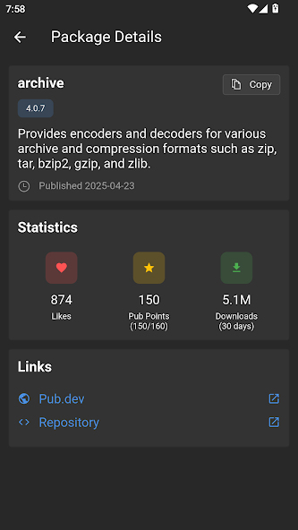

# FlutterEye

  

## 应用简介

FlutterEye 是一款专业的 Android 应用检测工具，专为开发者和 Flutter 技术爱好者设计。它能够快速扫描并识别当前设备上所有使用 Flutter 框架开发的应用程序，让用户轻松了解哪些应用采用了 Flutter 技术栈。

FlutterEye 提供了直观的界面和高效的检测机制，无需复杂配置即可使用。无论你是开发者想了解 Flutter 在市场上的应用情况，还是技术爱好者探索应用背后的技术栈，FlutterEye 都能为你提供准确、快速的应用识别服务。

应用已上架 Google Play 商店，支持所有运行 Android 系统的设备。

## 主要功能

|主页|详情|包依赖|
|-|-|-|
||||

**Flutter 应用检测**
- 自动扫描设备所有已安装应用
- 智能识别 Flutter 框架开发的应用
- 快速生成应用列表，一目了然

**版本信息查看**
- 显示每个 Flutter 应用的版本号
- 便于开发者追踪应用更新情况

**依赖项分析**
- 查看应用的 Flutter 框架版本
- 了解应用所依赖的组件库
- 为技术选型和兼容性分析提供参考

## 下载方式

**Google Play 商店**
- 直接在 Google Play 搜索 "FlutterEye" 或点击下方链接
- 下载链接：https://play.google.com/store/apps/details?id=com.ailin.flutter_eye

## 打赏支持

如果你觉得 FlutterEye 对你有帮助，欢迎通过以下方式支持我们的开发工作：

|[LinXunFeng](https://github.com/LinXunFeng)|[GitLqr](https://github.com/GitLqr)|
|-|-|
|||